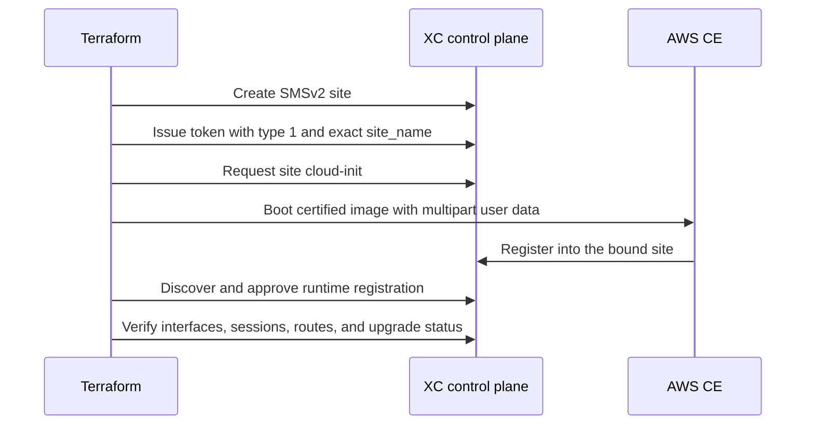

## Prerequisites

Use authorized cloud and XC credentials, an isolated backend, and the Terraform version
floor in [the source reference](../../../demo/terraform/). MCN pins provider v8.0.0.
Allow tens of minutes for bootstrap and hours for a serial upgrade rehearsal; stop at
bounded diagnostic gates instead of treating a time estimate as a health check.

## Bind tenant and artifact identity

Set `expected_xc_tenant` explicitly and verify the backend, cloud account, region,
site set, provider version, and artifact digest against the reviewed plan. A lock file
is useful evidence only if the selected binary actually comes from its installation path.

A global `dev_overrides` block can bypass version and lock-file expectations for provider
execution. Use a task-specific `TF_CLI_CONFIG_FILE` with registry installation for normal
operation; reserve a separate override file for an intentionally tested candidate.
Do not rename a shared CLI configuration as part of a deployment.
See [HashiCorp CLI configuration](https://developer.hashicorp.com/terraform/cli/config/config-file).

Provider v8 represents empty choices as nullable object **attributes**. For example,
`disable_ha = {}` selects that choice and `null` omits it. The old empty-block spelling
is not an alias. Not every nested structure is an empty choice: retain non-empty blocks
as shown in [the imported configuration](../../../demo/terraform/).

## Order bootstrap by platform

For site-bound JSON Web Token (JWT) bootstrap, create the site before issuing the token.
MCN implements this AWS flow in `aws_xc.tf` and `aws_ce.tf`:

| Platform path | Bootstrap ownership in current MCN source |
| --- | --- |
| AWS | `xcsh_token.aws` is site-bound; `xcsh_site_cloud_init.aws` supplies `/etc/vpm/user_data`. The multipart wrapper preserves the certified image's `/etc/vpm/config.yaml`. |
| Azure | `xcsh_token.ce` remains tenant-scoped; `cloud-init/ce-node.yaml` writes Azure-specific configuration. This historical implementation is not the AWS JWT sequence and was not re-proven by v8 acceptance. |

Do not copy the Azure template onto AWS-certified images. The AWS wrapper adds operator
SSH access and an early SLI default-route guard without replacing certified configuration.
The token value is `uid`, not the token resource name. Never print it while diagnosing ordering.

Sensitive rendering hides a value in normal output; it does not remove the credential
from downstream Terraform state, saved plans, or rendered bootstrap material. Restrict
backend access, encrypt state, and keep plans and diagnostic artifacts outside Git with
restrictive permissions. Review [registration diagnostics](../../workflows/registration/)
without dumping token-bearing files.

## Separate registration from routing

A runtime registration appears only after boot. Resolve it by site and node, then use its
actual registration identity for approval. Both current MCN platform graphs read registration at plan time and plan approval only
when found, so a later apply is required after a new node registers. Verify the runtime
identity rather than assuming a successful first apply included approval.

Approval and `ONLINE` are prerequisites, not route or traffic proof. Continue through
[interface discovery](../../interface-model/), [BGP diagnostics](../../workflows/bgp-diagnostics/),
route installation, and a request with the intended Host header.

## Stage routine changes

1. Save a refresh-enabled plan and inspect its exact targets and replacements.
2. Run the [MCN AWS preflight](../../../demo/deploy/) for every admitted AWS stage.
3. Apply the reviewed plan serially, observing one site's convergence before the next.
4. Poll with a deadline and preserve a sanitized reason for any timeout.
5. Apply the complete graph after targeted recovery so omitted dependencies converge.
6. Finish with a refresh-enabled plan showing no changes, then repeat the traffic check.

For AWS recovery, `aws_bootstrap_site_keys` is cumulative: `["01"]`, then `["01", "02"]`,
then all three keys. Removing an admitted key is not a harmless way to select the next
node. Stage membership controls JWT issuance and routing dependencies as well as checks.
Cloud-init records remain stable for all sites; admission does not delete their records.
Targeted plans are recovery tools; they do not replace the final complete plan.

## Stage the optional KVM physical-LAN SLI

The active Terraform root can add one physical-LAN Site Local Inside (SLI) NIC to
the existing single-node KVM CE. It is default-off: `enable_kvm_lan = false`
leaves the released one-NIC Site Local Outside (SLO) topology unchanged. The root
does not create, enslave, readdress, or delete the host bridge or physical uplink.
Only an explicitly inventoried `preprovisioned-shared` bridge is supported.
Trunk mode is rejected until guest VLAN tagging has its own implementation and
acceptance evidence.

Treat this as a two-plan rebuild, not a hot-add. Libvirt provider 0.8.3 does not
realize an added NIC through its domain Update path:

1. Record the bridge and uplink owner, exact uplink MAC, access VLAN behavior, MTU,
   IPv4 and IPv6 users, switch multi-MAC/anti-spoof approval, duplicate-address
   checks, reserved VIP, real HTTP origin owner, local DNS name, and access scope.
2. Set `enable_kvm_lan = true`, set `kvm_lan_configuration_phase = "hardware"`,
   and supply the complete `kvm_lan` object.
3. Create a full-root saved plan with
   `-replace='libvirt_domain.ce_node["01"]'`. Do not use `-target`. The plan must
   replace only the owned CE domain, keep SLO first, and create the bridged SLI
   second. Review its SHA-256 with `showcase-lifecycle.sh --mode kvm-lan-preflight`.
4. Apply that reviewed plan through the normal saved-plan path. After the rebuilt
   CE registers, the xcsh provider correlates both devices to the current Site UID,
   live registration, and Terraform-owned MACs. Do not guess `ethX` or reuse a
   prior registration suffix.
5. Set `kvm_lan_configuration_phase = "configured"` and review a second full-root
   plan. It may adopt and update only the exact owned runtime SLI child, and create
   the owned KVM LAN virtual site, origin pool, and HTTP load balancer. The primary
   SLO remains platform-owned and read-only.
6. Apply the reviewed plan, then prove the CE is online, the original single BGP
   peer remains established, exactly one SLO and one SLI exist, and an independent
   LAN client reaches the real origin through the inside custom VIP on port 80.
   Finish with a refresh-enabled zero-change plan.

The preflight mode checks the exact saved-plan digest, rejects AWS, Azure, shared,
or other unrelated actions, and observes that the declared bridge/uplink/MAC/MTU
already match the host. It exits before credential loading, service enablement,
Terraform initialization, or apply/destroy. Receipts are written mode `0600`
outside the repository. It does not prove the switch VLAN, IP reservation, local
DNS, origin service, ARP/neighbor behavior, return route, or client traffic; those
remain mandatory live acceptance evidence. Runtime interface names, hostnames,
and devices are provider outputs rather than operator-supplied inputs.

Disabling the feature removes only Terraform-owned XC application objects and
the CE's declared SLI topology. The shared bridge, uplink, physical LAN, local DNS,
and real origin are external prerequisites and must survive teardown. Review that
teardown as its own full-root saved plan; never infer authorization from this
documentation or run the unified lifecycle's destructive modes for inspection.

## Decide between upgrade and replacement

HA and registered SLO identity have platform immutability constraints. Review actual
replacement plans for topology edits rather than assuming a device-name correction always
requires a rebuild. The provider's narrow device-only update support does not authorize
changing arbitrary node topology in place.

Azure `custom_data` changes replace the virtual machine (VM). MCN couples site replacement
to the VM instance identity so a stale registration cannot reserve the replacement node's
identity indefinitely. Preserve that coupling; deleting only a registration did not resolve
the observed stale-site failure. See [SSH lifecycle](../../access/ssh/). Same-name replacement is an MCN lab observation,
not a general support guarantee: the [current F5 FAQ](https://docs.cloud.f5.com/docs-v2/multi-cloud-network-connect/faqs/smsv2-faqs)
says not to reuse a deleted site name within 30 days. Use fresh names for new deployments
and reconcile that support constraint before adapting the historical replacement procedure.

Create-time software settings are separate from upgrade actions. Provider v8 exposes
`xcsh_site_upgrade_sw`, `xcsh_site_upgrade_os`, and `xcsh_site_upgrade_status`; MCN's
`aws_upgrade.tf` applies the operational pattern one site at a time. Verify installed
versions and readiness after each action before moving on. Historical Azure API/disk
observations are in [versions and rebuilds](../../lifecycle/).

Nuke-and-pave is optional for immutable changes, a diagnosed stuck create-time installation,
or deliberate from-zero lifecycle proof. Routine drift, an absent route, or a polling timeout
first requires diagnosis. Rebuilding destroys useful evidence and does not repair a bad contract.

## Verify

Confirm the expected provider, site ownership, approved nodes, physical interfaces, sessions,
routes, and traffic. A no-change plan proves configuration convergence; it does not by itself
prove packet forwarding. Use the platform-specific acceptance procedure as the final gate.

## Clean up

Review a saved destroy plan for the isolated deployment before applying it. Preserve any
shared app namespace and unrelated resources. Retire private plan and bootstrap artifacts
according to the backend's retention policy; do not publish them as documentation evidence.
